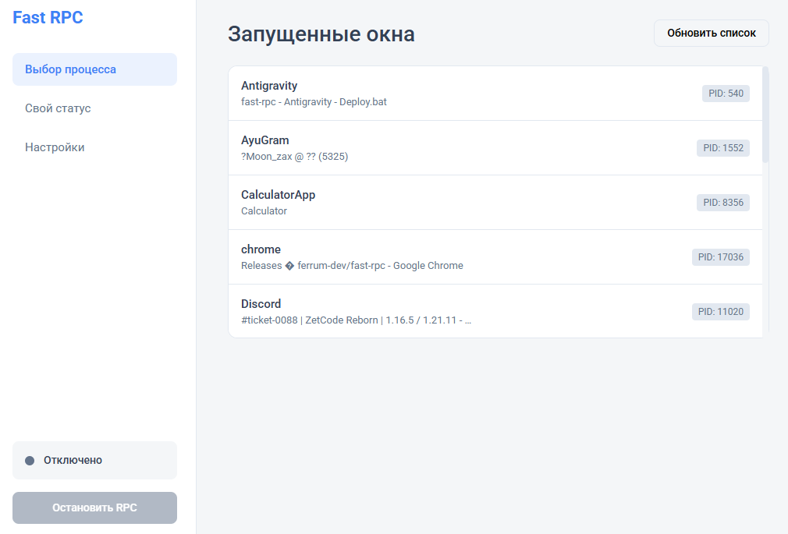
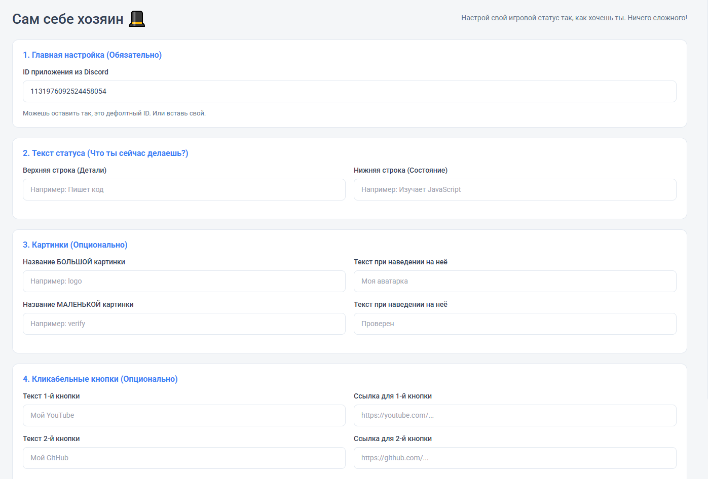

<br/>
<div align="center">
    <h1 align="center">Fast RPC</h1>
    <p align="center">
        Удобный, красивый и настраиваемый Discord Rich Presence (RPC) менеджер.
        <br />
        <a href="https://github.com/ferrum-dev/fast-rpc/releases"><strong>Скачать последнюю версию »</strong></a>
    </p>
</div>

***

### 🚀 О проекте
**Fast RPC** — это мощная программа-клиент, позволяющая вам полностью контролировать ваш статус ("Играет в...") в Discord. Построен на легких технологиях (**Node.js** + **Electron**), что обеспечивает моментальный отклик и невероятно чистый интерфейс!

### ✨ Главные особенности
* ✅ **Прямой перехват окон:** Вы можете выбрать любое открытое у вас на ПК окно или игру, и программа *сама* интегрирует её название в статус Discord! (Системный мусор скрывается автоматически!)
* 🎩 **Сам себе хозяин:** Режим Кастомного Статуса. Хотите поставить статус «Взламывает пентагон», добавить картинку и кликабельную кнопку на ваш YouTube? Запросто!
* 💾 **Сохранение данных:** Автоматически запоминает все ваши предыдущие настройки. Больше не нужно вводить ID и кнопки каждый раз заново! (Новое!)
* 💻 **Автозапуск вместе с ПК:** Настройте автозапуск в один клик. Программа запустится незаметно и сразу восстановит ваш любимый статус. (Новое!)
* ⚡ **Супер быстрый интерфейс:** Светлый и премиальный дизайн в стиле нативных приложений ОС, без лагов и задержек.

### 📷 Скриншоты



---

### 📥 Как начать использовать (Пользователям)
1. Перейдите в раздел [Releases](https://github.com/ferrum-dev/fast-rpc/releases) справа.
2. Скачайте последний `.exe` файл (например, `Fast RPC Manager Setup.exe`).
3. Запустите его — установка пройдет автоматически!
4. **Важно:** Не забудьте запустить свой обычный Discord, чтобы программа могла к нему подключиться!

### 💻 Как запустить исходный код (Разработчикам)
Если вы хотите изменить проект под себя:
```bash
# Клонируем репозиторий
git clone https://github.com/ferrum-dev/fast-rpc.git

# Переходим в папку проекта
cd fast-rpc

# Устанавливаем зависимости
npm install

# Запускаем в режиме разработчика
npm start
```

### 🔧 Сборка своего приложения (.exe)
Используйте встроенный скрипт для мгновенной сборки:
```bash
npm run build
```
Исполняемый файл появится в папке `dist`.

---
*Сделано с ❤️ для кастомизации Discord.*
